# Jupyter Notebooks in the IDE: Visual Studio Code versus PyCharm

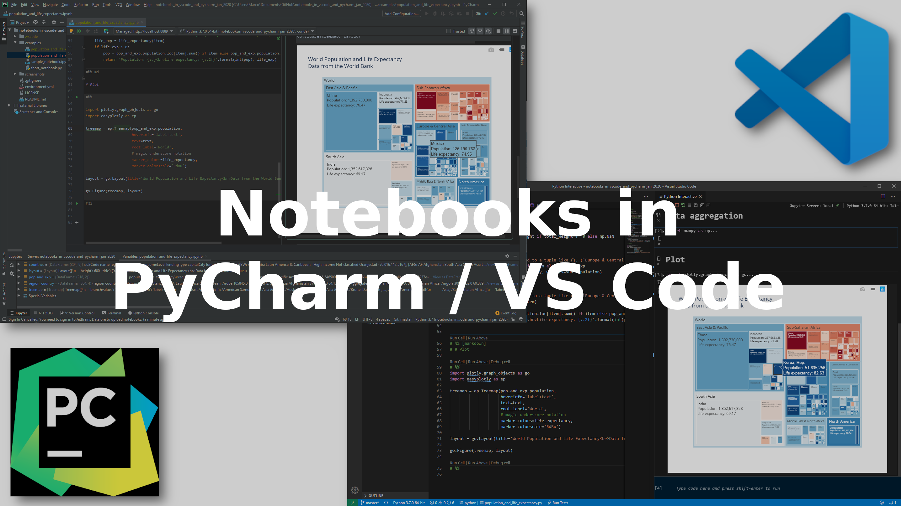

I work with Jupyter Notebooks every day. And every day I use and edit Python libraries. Both are key elements in my work. Notebooks are a great way to document and explain your findings. And libraries are a safe investment in the long-term as they make your code reusable. Now, did you ever wonder... outside of using Jupyter for the notebooks and IDEs for the libraries, could we do otherwise?

If you know me as the author of Jupytext, you already know that I think there's a lot of added value of being able to edit your Jupyter notebooks in your favorite IDE.

If you've not heard of Jupytext, then let me just mention that Jupytext is a plugin for Jupyter that lets you *pair* your traditional `.ipynb` notebooks with one or more text files. The paired text file, e.g. a Python script, can be *edited* (using any text editor or IDE), and then you get the changes back in Jupyter when you reload the notebook.

Jupytext offers one way of accessing your notebook from the IDE. But it is not the only way. Spyder has a long history of offering an interactive mode on scripts with double percent cell markers. Hydrogen is a plugin for the Atom editor that lets you run these scripts interactively. And the two editors that I most use, PyCharm and Visual Studio Code, now let you open your `.ipynb` notebooks directly in the IDE!

I was curious to see how well that works. Is the experience of using notebooks in those IDEs better than in Jupyter? Will I make the switch? In this article, I describe my current workflow with notebooks, then I compare it to what PyCharm and Visual Studio Code make possible now.

## My Workflow with Jupytext

I will take the example of a typical day at work. Today, I have to answer a new question about our data and algorithms. It turns out that I already answered a similar question in the past. So, to begin, I _search_ which of my existing notebooks is the closest to yield the answer to today's question.

Since I use Jupytext, all my `.ipynb` notebooks have a paired `.py` representation. So I open PyCharm, and use the _Find in Path_ search window to identify, among my collection of `.py` notebooks, which can get me started on today's question:

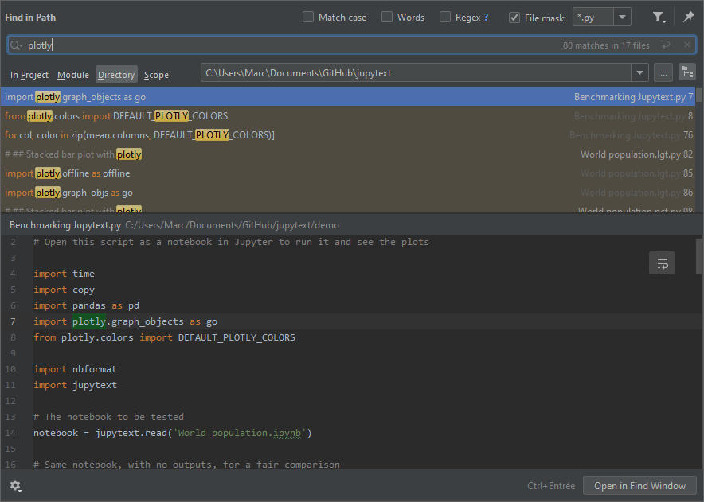

Let me add that
- the search experience is much improved when you restrict the search to `*.py` files, and add `.ipynb_checkpoints` to _Ignore Files and Folders_ in PyCharm Settings/Editor/File Types
- and that, if you want to pair all the notebook in the current directory to `percent` scripts, you can simply run `jupytext --set-formats ipynb,py:percent *.ipynb`.

Now I open the existing notebook, which will serve as a *template*. I copy an extract of its content - the part that I want to start with - to a new `.py` file. I take care of including the YAML header, because it's where the Jupytext pairing information and the notebook kernel are defined. Then I adjust the new `.py` notebook to today's question. In a Markdown cell (delimited with `# %% [markdown]`), I write a few words about what I want to do today. Then I adjust the code to better address the current question. Doing this in an IDE is more comfortable than in the notebook. It is also safer and faster, as I benefit from the IDE syntax checks and highlighting.

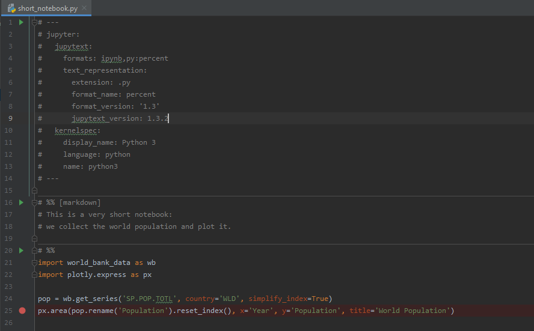

When my draft is good enough, I open the `.py` file in Jupyter _as a notebook_ (single click in Jupyter Notebook; in JupyterLab, right-click on the file, and choose _Edit with/Notebook_). At this stage, it has no outputs, so I run it. Of course, the new notebook will probably not work well on the first run, so I continue editing the notebook in Jupyter, until it runs properly.

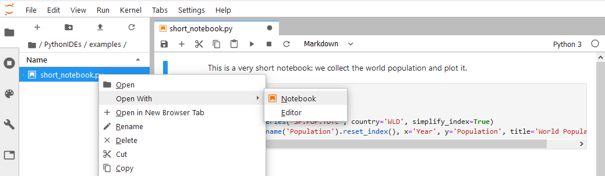

When I save the notebook in Jupyter, the `.py` file gets updated to match the latest contents. Also, an `.ipynb` file is created, with outputs included, because the Jupytext header has `ipynb` at this line: `formats:ipynb,py:percent`. And if I forgot to copy the header, I can use the Jupytext menu in Jupyter and select: _Pair notebook with .ipynb document_ to activate the pairing with a `.ipynb` notebook.

Now I am done. Usually, I will share the `.ipynb` file (using, for instance, Jupyter nbviewer), and version the `.py` file.

What do I most like about this workflow?
- Searching among notebooks is super easy - they are just text files.
- Drafting a new notebook is so comfortable. Never before was I able to copy-paste multiple cells from different notebooks so easily.
- When I edit the `.py` notebook in PyCharm, I benefit from the advanced capabilities of the IDE: syntax checks, completion, reformat, documentation tips...
- And I am also free to edit the notebook in Jupyter.
- Jupytext solves the issue of version control. Usually, I don't want to keep the notebook outputs in `git`, so I only version the `.py` file, which has a clean diff history.

Note that here I use PyCharm Professional, but it's only because it is my favorite IDE. You can use any other editor, the workflow will work the same.

What I am less fan of:
- Each notebook has a dual representation (`.ipynb`/`.py`). This may surprise more than one user.
- Working on the same document simultaneously in two editors (here, PyCharm and Jupyter) requires extra care. I must pay attention to saving the document in the current editor before switching to the other one (and maybe deactivate the autosave). And I need to _refresh_ the notebook in the editor I am switching to.
- PyCharm could execute and debug my script, however, the outputs appear as text in the terminal, so in practice, I prefer to execute the notebook in Jupyter.

## Jupyter Notebooks in PyCharm

PyCharm is my favorite code editor. Please don't ask me why, as I am not sure there is a single reason for that... What I am sure however is that it is so great to edit scripts and libraries there! Also, I love PyCharm's test and debugging tool suite (have a look at the Appendix to find out how to configure PyCharm). And version control is well integrated...

PyCharm is available in two editions: Community and Professional. You can do a lot already with the Community Edition. Jupyter notebooks, however, are only available in the Professional Edition.

I have prepared a test notebook made of
- a Markdown cell
- a code cell, which outputs a Pandas DataFrame
- a Matplotlib plot
- a Jupyter widget
- and a Plotly plot.

Now I open the notebook in PyCharm Professional 2019.3.1, and I get this:

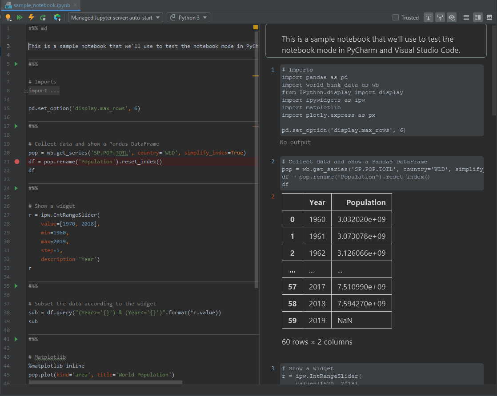

This is super impressive, isn't it?

What do I like most?
- All the outputs in the notebook work! Even the widget, or the Plotly graph. Well done, PyCharm!
- I can edit the notebook as a Python script. Just like with Jupytext, copy-pasting multiple cells is super easy! A new code cell is created with just `#%%`. Use `#%% md` to create a Markdown cell.
- The shortcuts for executing a cell are the same as in Jupyter (Ctrl+Enter, Shift+Enter to execute and move the cursor to the next cell). And the preview window is well synchronized with the input window. When you click on one input cell, the view pane automatically scrolls to the corresponding output, and vice-versa.
- You can leverage PyCharm when you type or inspect code (e.g., ctrl+click brings you to the definition of functions or objects). Code completion, documentation tips etc are available in the notebook.
- You can set *breakpoints*, both on the notebook or on the underlying libraries.
- And the notebook variables appear in the variable explorer:

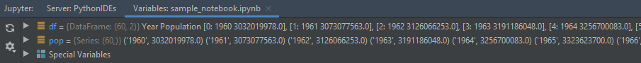

If there is something that I am not fond of, maybe that is how the notebook is displayed. It is significantly different from Jupyter, as the outputs appear in the preview pane. I am not used to that. It also reduces the room available for my plots or tables. I think I'd prefer to have the outputs just below the inputs, as in Code, Hydrogen or even RStudio. Also, at work, I may write very long notebooks, and for that kind of notebooks the _Table of Contents_ extension is super helpful as it lets me navigate easily between the different parts of the notebook - I'll probably miss that feature in PyCharm's notebook editor.

If you are one of PyCharm's developer team, let me tell you that, as a notebook user, I am so glad to see you working on this! You've done an impressive job! Now I have a few additional observations for you:
- Would you consider displaying the inputs right after the code cell? Could you do that and still let us select/copy/paste multiple cells easily?
- The Markdown cell markers are not standard. Following Spyder's conventions, `# %% md` is a cell with _title_ `md`. Could you instead use `# %% [md]` or `# %% [markdown]`, like Code, Hydrogen or Jupytext?
- The search window (_Find in Path_) does not work well with notebooks - it displays extracts of their JSON content. Displaying their `.py` representation could have been more user-friendly.
- Reformatting the code (Ctrl+Alt+L) is not effective in the context of a notebook.
- Executing the notebook adds some cell metadata (`{"pycharm": {"is_executing": false}}`).
- Lastly, maybe the `.py` format is not appropriate for all notebooks. Some of my tutorials contain a lot of text, and for those, I prefer to use Jupytext's Markdown format. PyCharm works well with Markdown files, but it won't let me run the code there... what would you think of rendering these documents as notebooks in the IDE?

Well done, PyCharm! Now let's see what VS Code has to offer.

## Jupyter Notebooks in Visual Studio Code

Visual Studio Code is a free and open-source editor developed and maintained by Microsoft. It is not specific to Python, and has plugins for many languages. Here we will be testing Code in version 1.41.1, with the latest [Python extension by Microsoft](https://marketplace.visualstudio.com/items?itemName=ms-python.python) released on Jan 13, 2020.

I use Code whenever I want to edit a Markdown file, or a script in any other language than Python, like Javascript or Typescript. But until recently I was not using Code much for Python. Looking back, I think the reason was that I did not know how to set up code to work with my conda environment. This is now solved and documented in the appendix, and I'd like to thank [Luciana](https://twitter.com/luumelo14) from the [Python Visual Studio Code](https://twitter.com/pythonvscode) team for helping me with that. 

Now let me open in Code the same notebook that we just opened in PyCharm. The result is like this:


What did I like?
- It works! All the outputs are nicely displayed (widgets are not yet supported, but I was told that they will be in the next release).
- Here as well, the shortcuts for executing one cell are the same as in Jupyter (Ctrl+Enter, Shift+Enter to execute and move the cursor to the next cell, Esc-A to create a cell above, etc).
- I like to have the outputs right under the code as in Jupyter.
- Typing code is comfortable thanks to the automatic completion.
- And we can examine the notebook variables in the variable explorer.

But maybe I want a bit more. I would like to select/copy/paste multiple cells at once. I would like to navigate to a function's definition, as we do in a script with ctrl-click. Why don't we have the same context menu than in `.py` scripts? I'd like to set breakpoints in my notebook... And, but I already said that, I would appreciate a _table of contents_ for finding my way in long notebooks.

Is my story over... No! There's one last thing I want to try. In Code's documentation: [Working with Jupyter Notebooks in Visual Studio Code](https://code.visualstudio.com/docs/python/jupyter-support), it is said that you can set up breakpoints once you _convert the notebook to a Python script_! Let's try that.

## Interactive Scripts in Visual Studio Code

Now we click on _convert the notebook to a Python script_. We get a script that looks like PyCharm's notebooks:

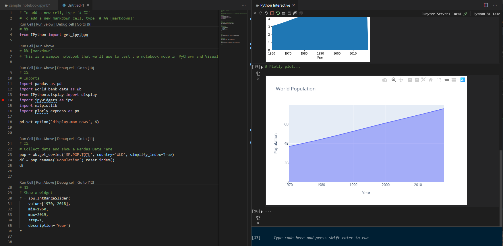

What do I like here?
- I can leverage Code's advanced functions to edit the file. Ctrl+click works and lets me navigate to definitions. I can easily select/copy/paste multiple cells at once.
- Tables, plots and interactive plots work in the interactive preview.
- I can type and execute Python code in the terminal without having to create a new cell. This is great! How many times did I create a new cell just because I needed to inspect a variable, and then I forgot to remove that cell from the notebook...
- The script uses the same cell markers as Jupytext. That means that I could rely on Jupytext for doing the conversion and sync between the notebook and script. In Jupyter, I would go to Jupytext/Pair with percent script, and save/reload the notebook to update both files. In the terminal, I would use `jupytext notebook.ipynb --set-formats ipynb,py:percent` and then `jupytext notebook.ipynb --sync` to keep the two files in sync.

What I like even more are the _breakpoints_. Put a breakpoint on the script, and you can _debug the cell_ and watch variables!

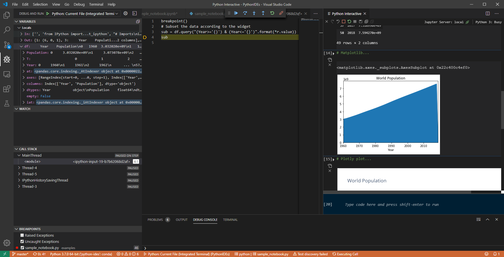

I like very much that interactive mode! At this point, it is one of my favorite ways of editing a notebook in an editor.

Now I have a few questions for the developers of the Python extension for Visual Studio Code: 
- I know that I can connect VS Code to a [local or remote Jupyter kernel](https://code.visualstudio.com/docs/python/jupyter-support#_connect-to-a-remote-jupyter-server). Now, could I share the same session between both Jupyter and Code, using for instance the `%connect_info` magic command? That would let me execute most of my notebook in Jupyter, and debug only a specific cell in Code, without having to re-run the notebook in full in Code.
- Jupytext allows me to edit my notebooks as either scripts or Markdown files. I find that the Markdown format is more appropriate for notebooks that contain more text than code, like tutorials or documentation. Would you like to offer a Markdown-mode for notebooks, or conversely, make Markdown files interactively executable in Code in the form of notebooks?

## Conclusion

Visual Studio Code and PyCharm are two great code editors. They make it so easy to design, edit or refactor Python code. So I really appreciate the idea of being able to open notebooks in those IDEs.

How should notebooks be represented in the IDE? I liked the script-like notebook mode of PyCharm, and the interactive script mode of Code, as they allow to work on the notebook in the exact same way as one works with scripts (copy/paste, navigate in code, set breakpoints...).

Will I make the switch to the IDE for my notebooks? I think I will continue to alternate between the IDE, when I want to search among my notebooks, draft a new notebook, refactor an existing one, or set a breakpoint, and Jupyter, when I want to navigate in the notebook using its Table of Content, analyse the plots, comment on my findings, or present the notebook.

## Acknowledgments

I want to thank the [Python Tools for VS](https://twitter.com/PT4VS), [Python Visual Studio Code](https://twitter.com/pythonvscode), and [JetBrains PyCharm](https://twitter.com/pycharm) developers for their work. I know by experience that addressing the notebook in the IDE has great potential, but is not an easy challenge. So I love to see more people working on this.

Let me also thank the early readers who helped me to improve this article: [François Wouts](https://github.com/fwouts), and at [CFM](https://www.cfm.fr), [Eric O. Lebigot](https://github.com/lebigot), [Florent Zara](https://github.com/flzara) and [Vincent Nguyen](https://www.linkedin.com/in/vincent-nguyen-31533672/).

## Appendix - How to reproduce this study

In this part, I share my notes on how to properly install Python and configure PyCharm and Code. My notes are for Windows 10, but I expect them to work for any platform.

### Getting the example files

Please clone the environment and example files from my [GitHub repository](https://github.com/mwouts/notebooks_in_vscode_and_pycharm_jan_2020):
```powershell
git clone https://github.com/mwouts/notebooks_in_vscode_and_pycharm_jan_2020.git
```

### Creating the Python environment with conda

Please install one of [Miniconda](https://docs.conda.io/en/latest/miniconda.html) or [Anaconda](https://www.anaconda.com/distribution/). If you don't know the difference, take Miniconda, it is lighter.

Then go to the start menu, type _Miniconda_ and then click on _Anaconda Powershell Prompt (Miniconda3)_. In the terminal, change the directory to this project, and then create the example Python environment with e.g.

```powershell
cd Documents\Github\notebooks_in_vscode_and_pycharm_jan_2020
conda env create --file environment.yml
```

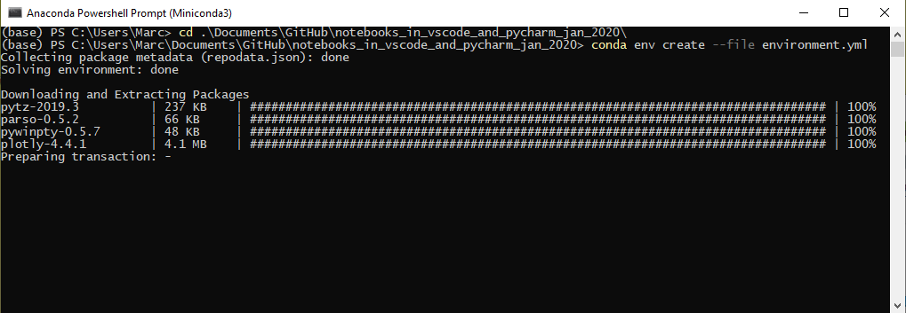

Now we activate the environment with
```powershell
conda activate notebooks_in_vscode_and_pycharm_jan_2020
```

### Launching Jupyter

The environment that we have just created includes Jupyter and Jupytext. Launch Jupyter with

```powershell
jupyter notebook
```

and you will be able to explore our example scripts and notebooks, and see how Jupytext works.

### Configuring PyCharm

Let me assume that you have installed either PyCharm Community or PyCharm Professional and that you have opened our `notebooks_in_vscode_and_pycharm_jan_2020` project in PyCharm.

The next step is to tell PyCharm which Python we want to use. For this, after having activated the environment, with `conda activate notebooks_in_vscode_and_pycharm_jan_2020`, we do execute `where.exe python` on Windows, or `which python` on Linux or Mac OSX:

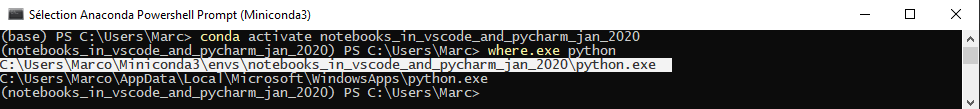

Now we go to File\Settings, search for _Project Interpreter_, click on the gear/Add, select _Existing Environment_, and paste the full path to the Python interpreter - in my case: `C:\Users\Marc\Miniconda3\envs\notebooks_in_vscode_and_pycharm_jan_2020\python.exe`.

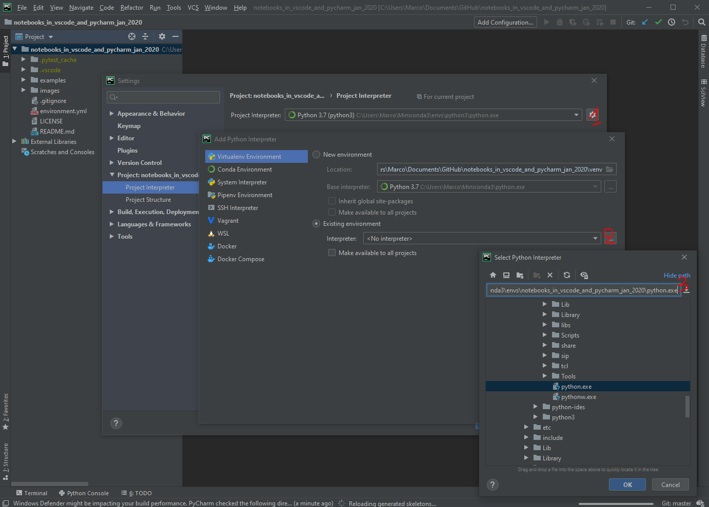

### Configuring Visual Studio Code

Visual Studio Code's [documentation](https://code.visualstudio.com/docs/python/environments) explains in detail how to configure Visual Studio Code with virtual Python environments.

If you want to use conda instead, you will have to launch Code from *within Conda*. So we go to the _Anaconda PowerShell Prompt_, and start VS Code by typing `code`:


Now you can close the shell. As Code inherited from the conda environment, you will be able to use Python and Jupyter from that environment.

Let me stress out that if you don't start Visual Studio Code *within conda*, you will get various types of errors, including:
1. `conda is not recognized as internal or external command.`
2. `CommandNotFoundError: Your shell has not been properly configured to use 'conda activate'` (I know, you added conda to your PATH... but that's not enough)
3. or even, `"Import Error: Unable to import required dependencies: numpy:"`.
